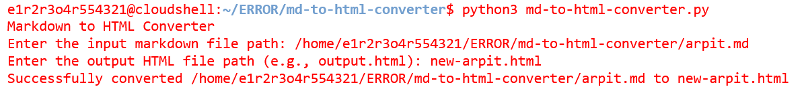
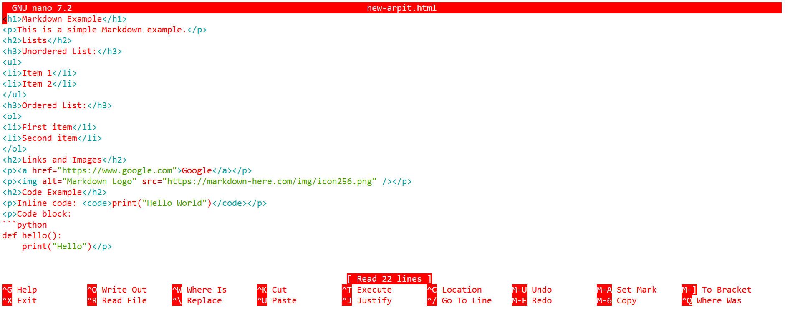

# Markdown to HTML Converter

This project is a simple Python program that converts Markdown (`.md`) files into HTML (`.html`) files.

## Output


and


## Features
- Converts Markdown to HTML
- Supports basic Markdown syntax: headings, lists, links, images, and code blocks
- Easy to use and lightweight

## Installation

1. Clone the repository:
   ```bash
   git clone https://github.com/GET-UNKNOWN-ERR0R/md-to-html-converter.git
   cd md-to-html-converter
   ```
2. Install Python Library:
   ```bash
   pip3 install markdown
   python3 md-to-html-converter.py
   ```
 ## License 
   
   
